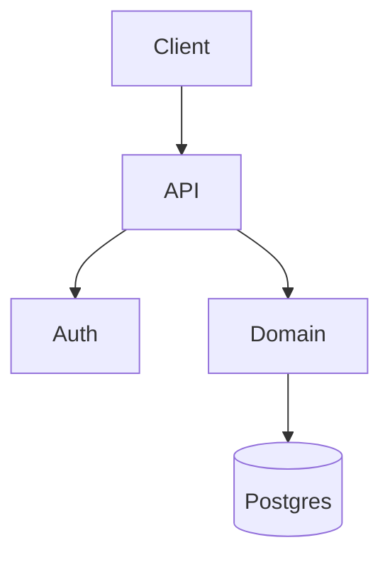

# SDS — extraction de design & architecture

## Modules à identifier

### TypeScript / JavaScript

- Workspaces / packages (`packages/*`, `apps/*`).
- Dossiers de premier niveau sous `src/` ou racine (ex. `auth/`, `api/`,
  `domain/`, `infra/`).
- Modules publiés via `index.ts` exportant un sous-ensemble cohérent.
- Boundaries Nest/Next : feature folders, modules, controllers/services.

### Python

- Packages top-level (dossiers avec `__init__.py`).
- Découpage par couche si présent (`domain/`, `application/`,
  `infrastructure/`, `interfaces/`).

### Critère d'arrêt de découpage

Un item SDS = **un module avec une responsabilité unique**. Si tu te
retrouves à écrire "et ... et ..." dans `responsibility`, scinde.

## Vues d'architecture à produire

Chaque vue est un item SDS de domaine `ARCH` :

- `SDS-ARCH-001` — vue logique (composants ↔ responsabilités).
- `SDS-ARCH-002` — vue de déploiement (si `Dockerfile`, `docker-compose`,
  `k8s/`, `serverless.yml` détectés).
- `SDS-ARCH-003` — vue de données (modèles principaux, persistance) —
  uniquement si une couche de persistance existe.

Pour chacune, inclure un diagramme **Mermaid** dans le corps Markdown :

```markdown
## Vue logique


```

## Dépendances

Pour chaque module, lister dans `interfaces.depends_on` :

- dépendances **internes** (autres modules du repo) — par leur ID SDS
  s'il existe, sinon par chemin relatif.
- dépendances **externes** (packages npm / PyPI) — nom + version
  (extraite de `package.json` / `pyproject.toml`).

## Linkage vers SRS

Pour chaque item SDS, remplir `links.implements:` avec les IDs SRS qu'il
réalise. Méthode :

1. Lister les exigences SRS dont les `source:` pointent un fichier inclus
   dans le module.
2. Pour chaque correspondance, ajouter l'ID SRS à `implements`.

Si un module n'implémente aucune exigence SRS détectée → marqueur
`[GAP-62304]` : soit le SRS manque, soit le module est mort.

## Anti-patterns à refuser

- Décrire le code ligne par ligne — décrire les **interfaces** et les
  **invariants**.
- Dupliquer la description SRS — le SDS dit *comment*, le SRS dit *quoi*.
- "Module utilitaire" sans responsabilité claire — soit la responsabilité
  s'extrait, soit le module est à refactorer (le signaler).

## Sortie

`docs/items/SDS/SDS-<DOMAIN>-<NNN>.md` par item, avec frontmatter
conforme à `items-store` et corps Markdown structuré :

```markdown
## Responsabilité
<1-3 phrases>

## Interfaces
### Entrées
### Sorties
### Dépendances

## Invariants
<contraintes maintenues par le module>

## Notes de design
<décisions notables, alternatives écartées>
```
